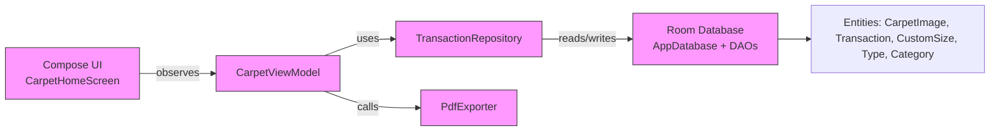
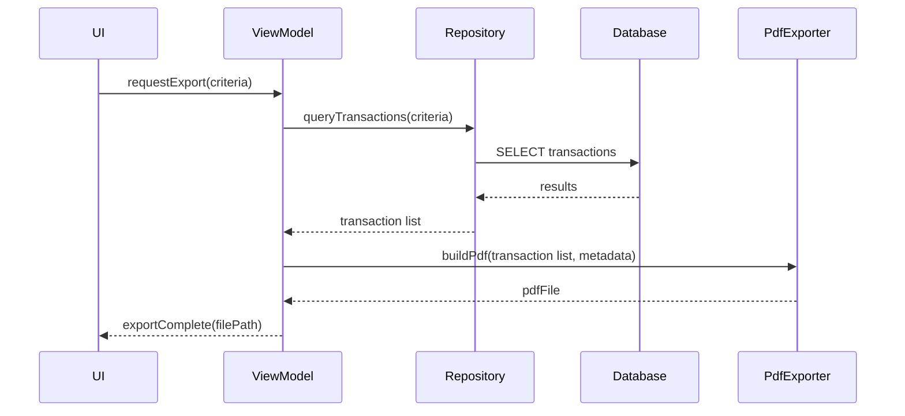
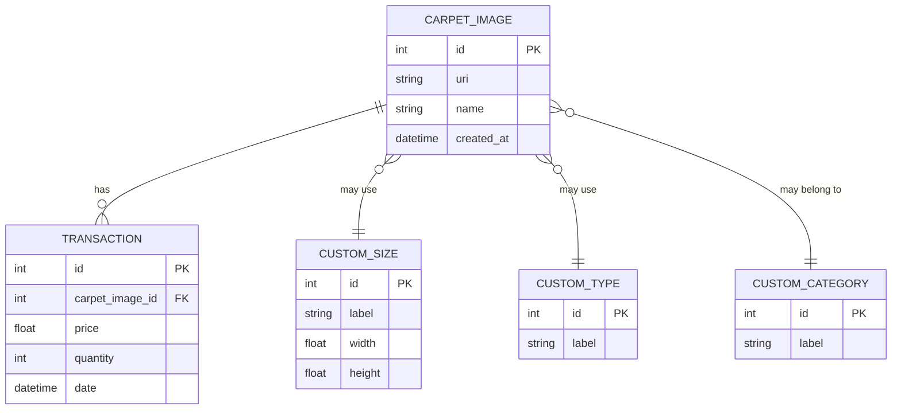

## Diagrams — Carpet Ledger

This file contains architecture and flow diagrams for the Carpet Ledger app. Use a Mermaid renderer to view the diagrams.

### Component diagram

### Export sequence (PDF)

### Database ER (simplified)

### Notes

- The diagrams are simplified to show relationships and main flows.
- To render Mermaid diagrams, paste the contents into a Mermaid live editor or a Markdown viewer that supports Mermaid.
